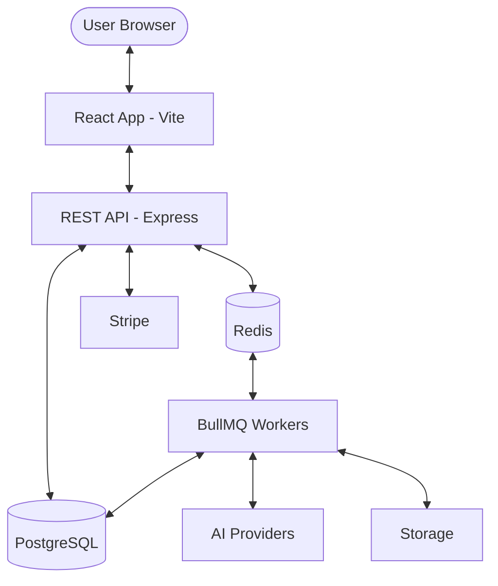

# DirectorByte Architecture

This document describes the technical architecture, data flows, and system design of DirectorByte v2.

---

## System Overview

DirectorByte is built as a monorepo containing a React frontend and an Express backend, supported by a PostgreSQL database and a Redis-backed job queue.

### Frontend (`apps/web`)
- **Framework**: React 18 with Vite for fast HMR.
- **State Management**: 
  - `zustand` for client-side application state (Auth, Studio, UI).
  - `react-query` for server-state caching and synchronization.
- **Styling**: Vanilla CSS with CSS Modules for scoped, performant styling.
- **Animations**: `framer-motion` for cinematic transitions and micro-interactions.

### Backend (`apps/api`)
- **Framework**: Express.js with TypeScript.
- **ORM**: Prisma for type-safe database access.
- **Authentication**:
  - JWT Access Tokens (Memory-only on frontend).
  - HttpOnly Refresh Tokens (Stored in secure cookies).
  - Admin Sessions (Table-backed, 4-hour duration).
- **Validation**: Zod for request body and environment variable validation.

---

## Authentication Architecture

DirectorByte uses a hybrid authentication model to balance security and user experience.

1.  **Standard Users**:
    - Login via Email/Password or Google OAuth.
    - On success, the server returns an `accessToken` in the JSON response and a `refreshToken` in a secure, HttpOnly cookie.
    - The frontend keeps the `accessToken` in memory and uses the `refreshToken` to get a new one before it expires.
2.  **Admin Access**:
    - Admins must sign in via a dedicated portal.
    - Authenticated admins receive an `AdminSession` record in the database.
    - Every admin action is validated against this session and logged in the `AuditLog`.

---

## Data Flows

### AI Generation Pipeline
The film generation process is asynchronous to handle long-running AI tasks.

1.  **Request**: User initiates a stage generation (e.g., "Generate Script").
2.  **Validation**: API verifies user quotas and credit balance.
3.  **Queue**: A `GenerationJob` is created in the database and added to the BullMQ `generation-queue`.
4.  **Worker**: A dedicated worker picks up the job, resolves the appropriate AI provider key (Managed or BYOK), and calls the AI provider.
5.  **Status**: The worker updates the job status (PENDING -> PROCESSING -> COMPLETED/FAILED).
6.  **Polling**: The frontend polls the job status and renders the output once completed.

### Subscription & Billing
1.  **Checkout**: User selects a plan; the API creates a Stripe Checkout Session.
2.  **Payment**: User completes payment on Stripe's hosted page.
3.  **Webhook**: Stripe sends a `checkout.session.completed` event to the `/api/v1/webhooks/stripe` endpoint.
4.  **Activation**: The API verifies the signature, updates the user's `Subscription` record, and resets usage quotas.

---

## Storage Abstraction

DirectorByte supports multiple storage backends via a `StorageAdapter` interface:

-   **Local**: Files stored on the server's disk (useful for development).
-   **Google Cloud Storage (GCS)**: Scalable cloud storage for production media.
-   **Google Drive**: Per-user storage where projects are synced directly to the user's personal Drive.

To add a new provider (e.g., S3), implement the `StorageAdapter` interface and register it in the `StorageFactory`.

---

## Job Queues

We use **BullMQ** (Redis-backed) to manage background processing:

-   `generation-queue`: Handles all AI generations. Supports priority (Paid > Free).
-   `email-queue`: Manages transactional emails (verification, password reset).
-   `cleanup-queue`: Periodically removes expired sessions and temporary files.
-   `subscription-queue`: Processes recurring billing checks and usage resets.
